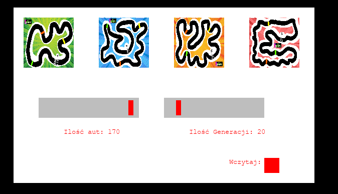
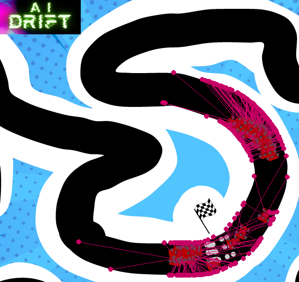

## Car_AI
Autonomous Car Racing with NEAT

# Overview

This project demonstrates an autonomous car racing simulation using the NEAT (NeuroEvolution of Augmenting Topologies) algorithm.
The cars navigate through a race track, avoiding obstacles, and striving to reach checkpoints to maximize their fitness.

# Features

- Car Class: The Car class represents the autonomous car, featuring controls for speed, angle, and rewards.
- NEAT Algorithm: The NEAT algorithm is implemented for training the cars to navigate the race track intelligently.
- Collision Detection: The cars can detect collisions with the track borders and receive rewards upon reaching specific checkpoints.
- Radar System: Each car is equipped with a radar system to sense obstacles and navigate the environment effectively.
- Configurable Options: Users can configure various options, such as the map, starting position, the number of cars, and the number of generations through the options menu.

# Options Menu

- Map Selection: Choose from different maps for varying difficulty levels.
- Number of Cars: Adjust the number of cars participating in the simulation.
- Number of Generations: Define the number of generations for the NEAT algorithm to evolve.

# Screenshots

